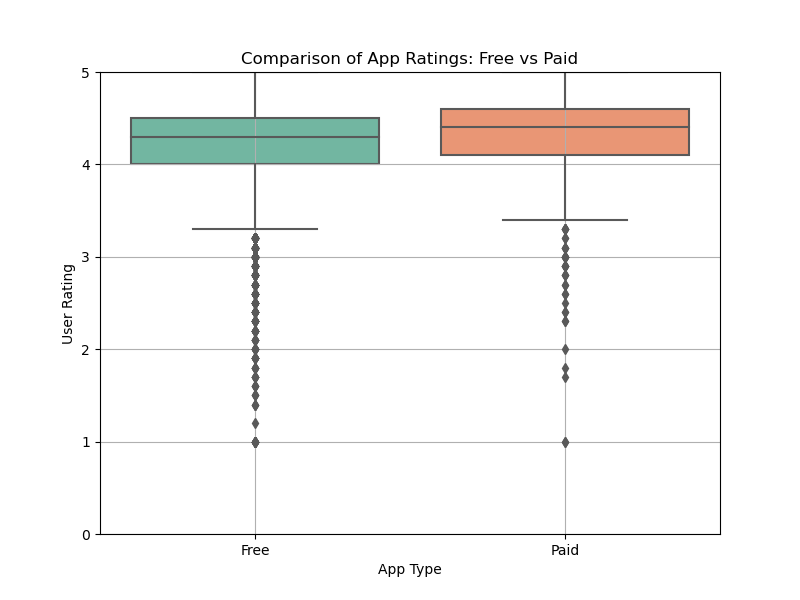
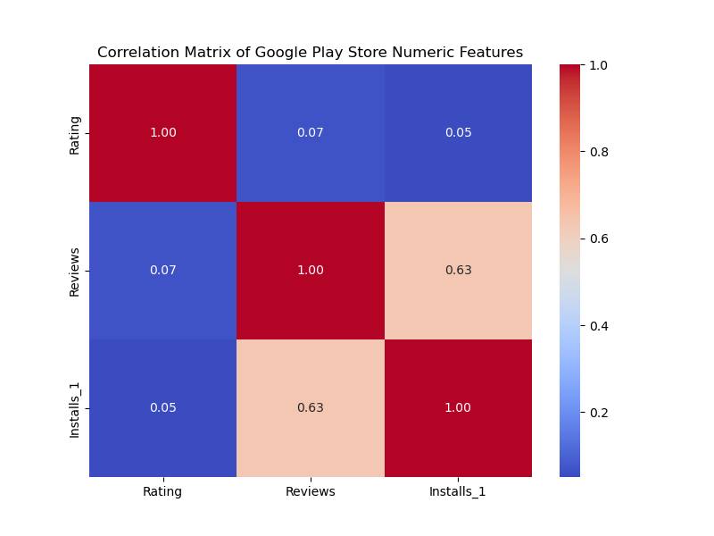

# 📱 Google Play Store EDA

Exploratory Data Analysis (EDA) on apps listed in the Google Play Store to identify patterns in app ratings, reviews, pricing, installs, and categories.

---

## 📌 Objective

To analyze a dataset of Google Play Store apps and extract meaningful insights that can help make data-driven decisions.

---

## 📂 Dataset

- **Source**: [Google Play Store Apps Dataset on Kaggle](https://www.kaggle.com/lava18/google-play-store-apps)
- **Size**: ~10,000 rows and 13 columns
- **Features**: App name, Category, Rating, Reviews, Size, Installs, Type (Free/Paid), Price, Content Rating, Genres, Last Updated, Current Version, Android Version.

---

## ❓ Key Questions Explored

- Which app categories are most common?
- What is the distribution of app ratings?
- How do installs vary across categories?
- Are paid apps better rated than free apps?
- Is there a correlation between price and rating?

---

## 🛠️ Tools & Technologies

- Python
- Pandas
- NumPy
- Matplotlib
- Seaborn
- Jupyter Notebook

---

## 📊 Key Insights

- Most apps belong to the **"Family"** and **"Game"** categories.
- **Free apps** dominate the store (~92%), but paid apps sometimes receive slightly better ratings.
- **Rating distribution** is slightly left-skewed with most apps rated between 4.0–4.5.
- **Number of installs** varies heavily across categories; a few apps have over a billion downloads.
- Some apps have suspiciously high reviews or installs, indicating possible outliers or fake data.
- The **Family** and **Game** are the two most popular categories as more than 66% of the total apps belong to these categories.
- **Facebook** App has the maximum no of reviews
- Apps in the **Books_and_reference** and **Business** categories have the most no of installs.
- There is a strong positive correlation between the no of reviews and the no of installs
-
- ## 📎 Files

- `google_Playstore1.ipynb` – Jupyter notebook with full EDA workflow.
- `README.md` – This file.
- gooleplaystore.csv- Dataset

 ## 📊 Visualizations

### Free vs Paid App Ratings

### Correlation Matrix 

---

